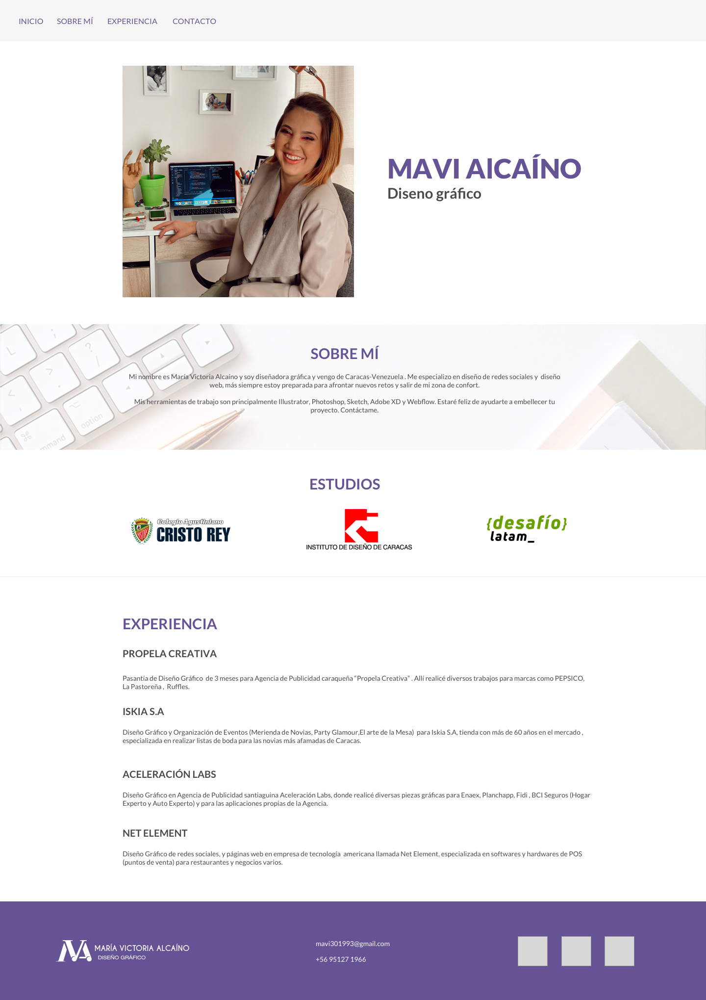
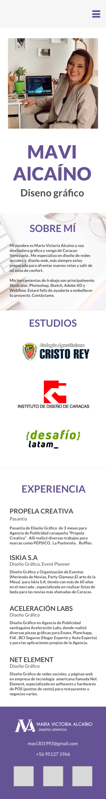

A continuación adjunto mi Curriculum Vitae, para que conozcan un poco más de mi formación , trabajo y experiencia laboral. Para realizarlo utilicé todo lo aprendido en el módulo de Diseño Responsivo como CSS Grid y la propiedad de Float , agregando colores representativos de mi marca y un menú colapsable en la parte superior para que puedan desplazarse por la página.

